<h3><code>dom@arch ~ $ ./contributions.sh</code></h3>

  

<h3><code>dom@arch ~ $ whoami</code></h3>

<table>
  <tr>
    <td valign="top"></td>
    <td valign="top"></td>
  </tr>
</table>

 

# Dominique Contreras
### Systems, Backend & Game Dev | Arch Linux · CachyOS · .NET / YARP · Unity & Godot · Android Offline-First

  
  
  
  

---

### Profile Overview
Ingeniero de software y sistemas orientado a desarrollo en entornos Linux (Arch Linux / CachyOS / Zen Kernel), arquitectura backend de alto rendimiento, desarrollo de videojuegos (Unity y Godot) y sistemas embebidos de bajo nivel.

- **Linux & Sistemas:** Entorno nativo de trabajo y despliegue en Arch Linux y CachyOS, virtualización KVM/QEMU, scripting avanzado en Bash/Fish y compiladores/DSLs desde cero.
- **Backend & Datos:** Gateways con .NET/YARP, microservicios, APIs RESTful y modelado relacional en PostgreSQL (PL/pgSQL).
- **Game Development:** Desarrollo en Unity y Godot (C# / GDScript), además de gráficos interactivos 3D en la web con WebGL y Three.js.
- **Mobile & Embebidos:** Aplicaciones móviles nativas offline-first con Kotlin y persistencia local (Room), y firmware para microcontroladores (PIC/ESP32) en C y Assembly.

---

### Flagship Projects

#### 1. Shapi - API Gateway & White-Label Marketplace
- Arquitectura de red y proxy inverso para plataforma de distribución y monetización de APIs.
- Enrutamiento dinámico con .NET y YARP, autenticación centralizada y persistencia con PostgreSQL.
- **Stack:** .NET Core, YARP, PostgreSQL, PL/pgSQL, Docker.

#### 2. [ASTRA & BioSphere - Scientific Simulation Engine & WebGL IDE](https://github.com/Dom-cs13/astra-biosphere-webgl)
- Motor de simulación y lenguaje de dominio específico (DSL) para habitabilidad planetaria.
- Analizador léxico y sintáctico en C#, con entorno interactivo 3D en WebGL utilizando Three.js y animaciones sincronizadas vía GSAP.
- **Stack:** C#, Compilers (Lexer / AST), Three.js, WebGL, GSAP.

#### 3. [Ovum - Offline-First Mobile Poultry Platform](https://github.com/Dom-cs13/ovum-mobile)
- Solución móvil nativa para Android diseñada para operatividad en zonas rurales sin conexión.
- Persistencia local ACID mediante Room Database y sincronización en segundo plano con WorkManager y Firebase.
- **Stack:** Kotlin, MVVM, Room Database, WorkManager, Firebase.

---

### Technical Arsenal

| Dominio | Tecnologías |
|---|---|
| Entorno & Infraestructura | Arch Linux, CachyOS (Linux Zen), Bash/Fish, Docker, KVM/QEMU, Git CI/CD |
| Backend & Arquitectura | .NET Core, ASP.NET, YARP (Reverse Proxy), Microservicios, REST APIs |
| Bases de Datos | PostgreSQL (PL/pgSQL, Triggers, Procedimientos Almacenados), MariaDB, Room DB |
| Game Dev & Gráficos | Unity, Godot (C# / GDScript), Three.js, WebGL, GSAP |
| Compiladores & Bajo Nivel | Diseño de DSLs, Lexers, ASTs, x86 Assembly, MPLAB XC8 (PIC16F), ESP32-C3 |
| Desarrollo Móvil | Android Nativo (Kotlin), MVVM, Room Database, WorkManager, Offline-First |
