<h3><code>dom@github ~ $ ./contributions.sh</code></h3>

  

<h3><code>dom@github ~ $ whoami</code></h3>

<table>
  <tr>
    <td valign="top"></td>
    <td valign="top"></td>
  </tr>
</table>

  

<h3><code>dom@github ~ $ ./links.sh</code></h3>

<b>Aspiring Developer · Python · JavaScript · HTML · Unity & Unreal Engine</b>

 

